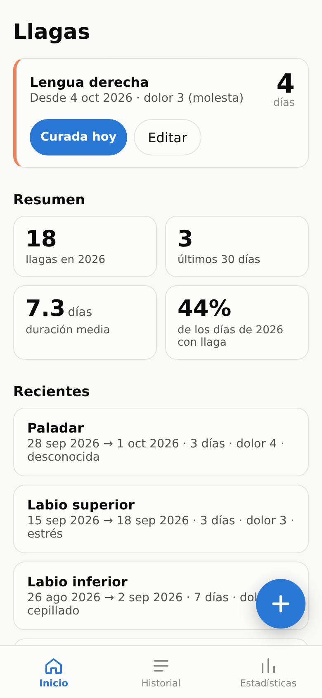
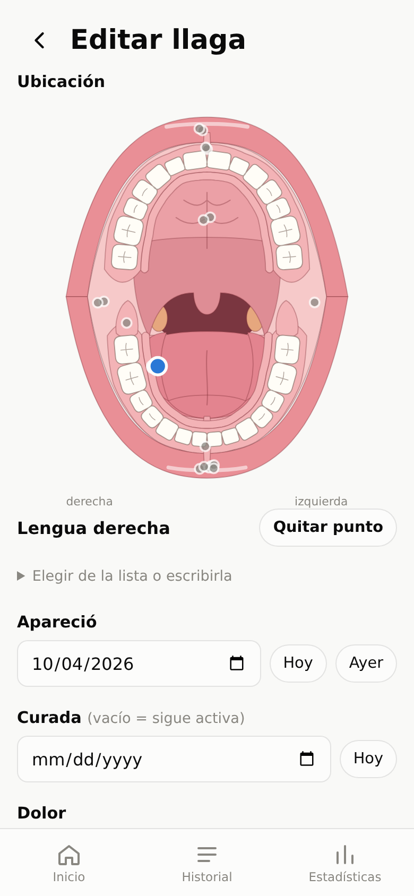
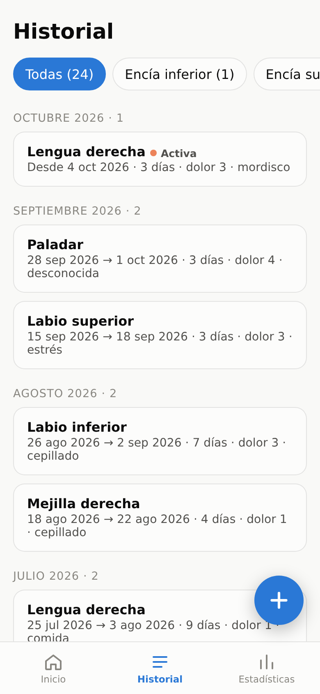
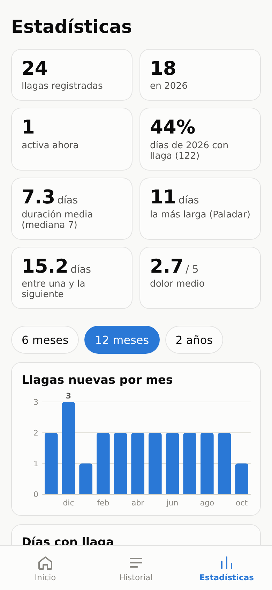
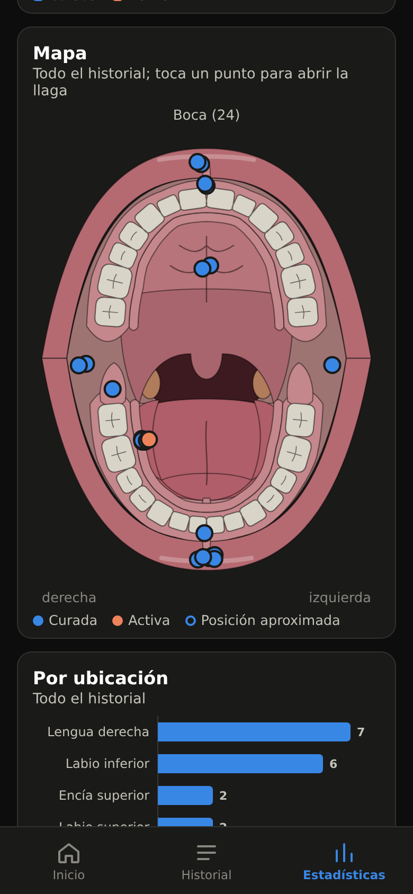

# Llagas

[](https://github.com/christt105/llagas/actions/workflows/ci.yml)
[](https://github.com/christt105/llagas/tags)

Self-hosted tracker for mouth ulcers: quick logging from the phone, history, statistics, a tappable mouth map, and photos stored in Immich (only asset ids are kept here, nothing is duplicated). Installable as a PWA. The UI is in Spanish.

<p>
  
  
  
  
  
</p>

<sub>Screenshots use generated demo data.</sub>

## Features

- **Home:** active sores with their day count and a one-tap "healed today", a yearly summary and the latest sores.
- **Mouth map:** the location is picked by tapping an open-mouth drawing (lips, gums, teeth, palate, uvula, tonsils, tongue, floor of the mouth, cheeks and retromolar areas). The tapped zone fills in the location name; right and left are the patient's, as in dental charts. Previous sores are shown in grey on the same drawing.
- **History:** sores grouped by month, filterable by location.
- **Statistics:** totals, active sores, share of days with a sore, mean and median duration, longest sore, days between sores, mean pain, new sores and sore days per month, a timeline, a map with every sore, and breakdowns by location, duration, cause and treatment.
- **Photos:** pick the Immich photos taken on the days the sore lasted, or take one from the app; both end up in an Immich album.

## Stack

- **Server:** Node 22 (native TypeScript type stripping), [Hono](https://hono.dev), SQLite through the built-in `node:sqlite` (no native dependencies).
- **Web:** Preact + Vite, hand-written SVG charts and mouth drawing, service worker for offline shell and cached thumbnails.
- **Shared:** `shared/stats.ts` computes every statistic client-side from the full list of sores; `shared/mouth.ts` defines the drawing (the dental arches are generated from one curve each, teeth keep real proportions).

No authentication: it is meant for the LAN (and Tailscale when away from home).

## Data model

| Field | Notes |
| --- | --- |
| `started_on` / `healed_on` | ISO dates; `healed_on` empty means the sore is still active |
| `location` | free text, filled in from the map or suggested from history |
| `map_view`, `map_x`, `map_y` | optional point on the mouth drawing, coordinates normalised to 0-1 |
| `pain` | 1-5, optional |
| `cause`, `treatment` | closed vocabularies in `shared/vocab.ts`, optional |
| `notes` | free text |
| `sore_photos` | ordered Immich asset ids |

Duration is always derived (`healed_on - started_on`), never stored. Sores without a point are drawn at the centre of their zone when the location matches a zone name exactly.

## Configuration

| Variable | Default | |
| --- | --- | --- |
| `PORT` | `8080` | |
| `DATA_DIR` | `data` | SQLite file is `$DATA_DIR/llagas.db` |
| `IMMICH_URL` | | e.g. `http://192.168.1.15:2283`; photos are disabled without it |
| `IMMICH_API_KEY` | | needs `asset.read`, `asset.view`, `asset.upload`, `album.read`, `album.create`, `albumAsset.create` |
| `IMMICH_PUBLIC_URL` | `IMMICH_URL` | used for "open in Immich" links |
| `IMMICH_ALBUM` | `Llagas` | linked and uploaded photos are added to this album |
| `TZ` | | set it so Immich date searches match local days |

## Deployment

Images are published to GitHub Container Registry as `ghcr.io/christt105/llagas`, with the tags `vX.Y.Z`, `vX.Y` and `latest`.

```yaml
services:
  llagas:
    image: ghcr.io/christt105/llagas:${LLAGAS_TAG:-latest}
    restart: unless-stopped
    ports:
      - "8097:8080"
    environment:
      TZ: Europe/Madrid
      IMMICH_URL: http://immich.lan:2283
    env_file: .env # IMMICH_API_KEY, LLAGAS_TAG
    volumes:
      - ./data:/data
```

The image runs as uid 1000 and keeps its database in `/data`. To upgrade, bump `LLAGAS_TAG` and run `docker compose pull && docker compose up -d`. Schema changes are applied automatically on start.

### Installing the PWA over plain HTTP

Service workers require a secure context. On a LAN address without HTTPS, enable `chrome://flags/#unsafely-treat-insecure-origin-as-secure` on the phone with the app's origin (e.g. `http://192.168.1.15:8097`) and relaunch Chrome; "Install app" then becomes available.

## Development

```sh
npm install
npm run dev:server   # API on :8080
npm run dev:web      # Vite on :5173, proxies /api
npm test
npm run typecheck
```

`main` is protected: changes go through pull requests, which must pass the `Test` job (typecheck, tests and build). Every pull request from this repository also publishes a preview image, `ghcr.io/christt105/llagas:pr-<number>`, so it can be tried on the server before merging.

### Releases

Pushing a `vX.Y.Z` tag that points at a commit on `main` runs the tests and publishes the image with that version, `vX.Y` and `latest`. Tags outside `main` fail the release.

```sh
git tag -a v0.2.0 -m "v0.2.0" && git push origin v0.2.0
```

## Importing from Obsidian

Reads every `type: llaga` note in a folder (`fecha_aparicion`, `fecha_desaparicion`, `ubicacion`, `dolor`, `causa_sospechada`, `tratamiento`, note body as notes). Embedded images (`![[IMG_x.jpg]]`) are looked up in Immich by original file name and linked. Idempotent: sores are matched by start date and location, and photos are only linked to sores that have none.

```sh
DB_PATH=path/to/llagas.db IMMICH_URL=... IMMICH_API_KEY=... npm run import:obsidian -- <folder> [--dry-run]
```
